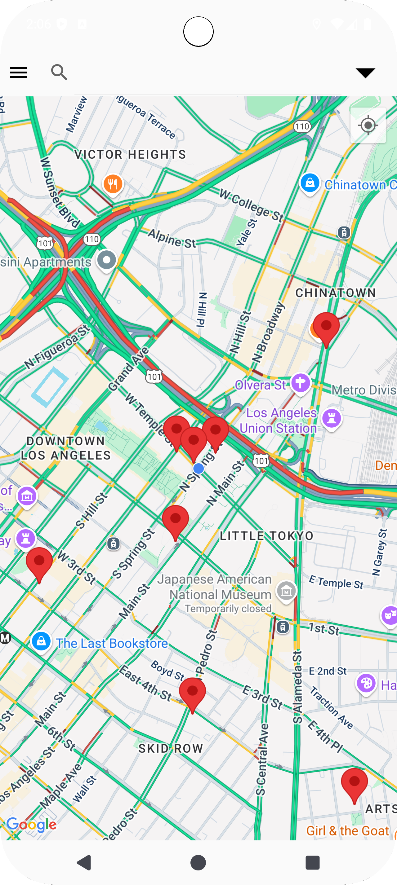
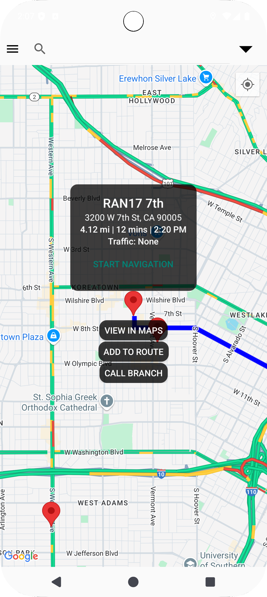
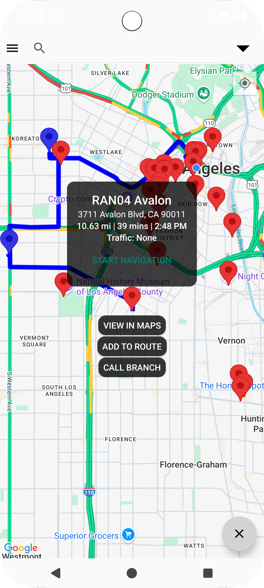
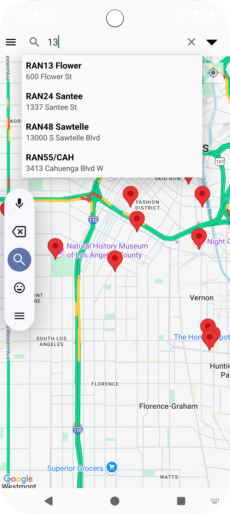
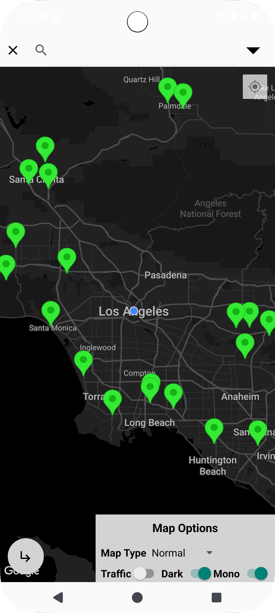

#  Branch Directory Map

This project and associated README file are under active development and may change at any time. Please consider watching this repository if you're interested in tracking its progress.

## Table of Contents

- [Overview](#overview)
- [Features](#features)
- [Gallery](#gallery)
- [Requirements](#requirements)
- [Installation](#installation)
- [adbc.bat](#adbcbat)
- [Roadmap](#roadmap)
- [Accuracy](#accuracy)
- [Security](#security)
- [Data Collection](#data-collection)
- [Known Issues](#known-issues)
- [Changelog](#changelog)

## Overview

Branch Directory Map is my latest Android app, coded mostly in Java using Android Studio. This app primarily uses the Google Maps SDK for Android and various Google API's. Basically it reads CSV files (converted from XLSX files or other sources) and then parses this data to create an SQLite database, and then contacts Google Maps Geocoding API to get latitude/longitude positions and stores them for future retrieval in the database. Users can see all the valid locations or branches on a Google Map fragment, with custom coloured markers for each CSV file read. Users are able to search for branches based on branch codes or names or addresses, and get information about that branch like distance and ETA, as well as traffic information and a polyline projected on the map to show the optimal route to take. Users can also call branches that have listed phone numbers. There is also a routing feature that lets users add multiple branches to a route and use the Google Maps app for Android to navigate to all the branches on the route, as well as show all information for the whole route. This app is in an alpha status currently, so commercial usage isn't advised just yet, although my ultimate goal is to make this app usable by any company who needs a mapped branch directory for driver navigation. I am a driver for one of the largest rental car companies in the world and I developed this app to help myself and my coworkers navigate between the hundreds of branches and dealerships we deal with, and it has been popular among Android-user drivers. An iOS version is planned in the future once I learn Flutter.

With the current Essentials tier, Google is surprisingly generous with 10,000 free calls per API for all non-Pro/Enterprise level Google Maps Platform API's. Refer here for Google's latest tier-based pricing and limits: [Platform Pricing & API Costs](https://cloud.google.com/maps-platform/pricing)

## Features

- use either Directions API for simple routing or Advanced Routing features using Routes API
- add up to 23 (or 25 if using Advanced Routing) intermediate branches within one route using waypoints
- pre-code waypoints for markers using comma separated plus codes in the refined address field, useful for routing to markers whose approaching road is incorrectly chosen by Google
- CSV or DB files can either be hard-coded with the app or read from a file by the user using `ActivityResultContracts.GetContent()`
- geocode using either just address, or address + postal code, or Google plus codes (if detected), and optionally add a custom modifier to all addresses
- ability to bundle DB files with release with pre-geocoded markers so users don't need to geocode (very costly for hundreds of markers per user)
- export DB file to Downloads folder once all markers have been geocoded
- uses `EncryptedSharedPreferences` to store API key for HTTPS requests, since this key cannot be secured without a backend proxy
- conditional approach to dependencies/imports so you can either implement Firebase Remote Config or Java NDK C++ obfuscation to retrieve the insecure API key
- includes two sample CSV files in assets folder, along with the geocoded markers in a DB file, with a sample gradle.properties.example file with the right settings to geocode/map the locations in the CSV files
- optionally uses [RootBeer](https://github.com/scottyab/rootbeer) (by [Scott Alexander-Bown](https://github.com/scottyab)) to prevent root access and denies debugging mode to further protect the insecure requests API key
- ability to change map layers including traffic and satellite views, various traffic routing models, route preferences like tolls/highways/ferries, and custom templates for dark and monochrome maps

## Gallery

<p align="center">
    
    
    
    
    
</p>

## Requirements

- Android Studio 2024 or later
- Android 6.0 Marshmallow (API 23) or later required (to use `EncryptedSharedPreferences`)
- Google Cloud account (free to make, requires valid credit card, must create a new project)
- two Google API keys: one secure and restricted to only Android, the app's package name plus SHA-1, and the Maps SDK for Android API; the other insecure and restricted to Google Directions/Geocoding/Routes API's
- to protect insecure API key: either a Firebase account (must create a new project to not link with Google Cloud) with Remote Config, or Java NDK for C++ obfuscation
- file called `api.dat` (included in `.gitignore`) in your root project folder with the app API key on the first line, and if using NDK then the requests API key on the second line, this file should not be bundled with a build or committed to a repository
- if using Firebase Remote Config, get the `google-services.json` file from Firebase and place it in your `app\src` folder, and create a new Remote Config parameter called `geocode_api_key` with the value of the requests API key
- RootBeer (optional, from Maven Central, doesn't require additional setup)

## Installation

Detailed instructions coming soon. For now just clone the repository, unzip it, and load the folder as a project in Android Studio. Then, copy all of `gradle.properties.example` into the auto-generated `gradle.properties` file, and either use the example values and CSV files or make your own configuration and add your CSV files to `app\src\main\assets`. Read the [Requirements](#requirements) section for more information. You are now ready to compile and run your first build.

## adbc.bat

I have included a helper batch file `create_adbc.bat` which creates my little adb companion (adbc), a simple script to run adb/adb emu/gradlew commands from terminal in Android Studio, including pre-programmed commands. Open a new terminal window and run the following command:
```
.\create_adbc "<adb directory>" <device IP address> <optional port number>
```
Replace the <> values with the appropriate parameters, preserving the double quotes. This will create a file called 'adbc.bat' in the same folder. If your device isn't paired with adb yet, enable wireless debugging on the device, select the Pairing Code option, make note of the debugging port and the 6-digit pairing code, and run the following command:
```
.\adbc pair <debugging port> <pairing code>
```
After a few seconds it should say the pairing was successful. By default, since API 31, Android randomizes the port number for tcp/ip every time wireless debugging starts. This little script will force port 5555, or your specified optional port, through adb. But this setting will reset every time you restart your device. To change port to 5555, or the optional port you specified earlier, run the following command:
```
.\adbc <device port>
```
Provide the proper port number from the wireless debugging settings on your device, it should be 5 digits. `adbc.bat` will change the port number and reconnect. From then on, until your device restarts, you can just call `.\adbc` to reconnect from within Android Studio on the default port 5555, or your optional port, even if wireless debugging isn't explicitly enabled on the device. After a restart, just provide the wireless debugging port number again. To disconnect from the device, run the following command:
```
.\adbc disc
```
The `adbc.bat` port configuring function does not work when multiple devices/emulators are detected by adb. To list all connected devices, run the following command:
```
.\adbc list
```
By default the latest versions of adb will use mDNS discovery to auto connect to previously paired devices even if they're connected to already, sometimes causing duplicate entries in Android Studio. To toggle this behaviour, use the following command:
```
.\adbc auto <on/off>
```
To directly pass arguments to adb use the following command:
```
.\adbc -a <arguments>
```
You can run the following command to mitigate issues with gradle daemon taking up too much memory or not releasing files to clean them:
```
.\adbc stop
```
This calls the gradle wrapper (gradlew) to stop the gradle daemon (OpenJDK Platform binary) process, it will automatically restart when you sync/clean/build. To run other gradlew commands use the following command:
```
.\adbc -ga <arguments>
```
The script can also run commands for the emulator. For example, to kill the emulator if one instance is running, use the following command:
```
.\adbc kill
```
To run any other emulator commands use the following command:
```
.\adbc -ea <arguments>
```
This batch file, and the `create_adbc.bat` file, require that you run it from your project root folder.

## Roadmap

- ability to convert XLSX files to CSV in the app
- localization support for languages and RTL interface as well as different address formatting
- further fields in the database also parsed from the CSV, including notes, hours of operation, manager, etc.
- ability to track users from Firebase for authentication
- selecting a marker more than once for a route
- developer mode to separate file reading and geocoding from release going to drivers
- unit testing and release configuration including key signing
- user feedback through Firebase to report wrong information, address changes, new branches to add, or bugs
- distribute DB files through Firebase so users don't have to geocode anything themselves, preventing further API costs
- backend proxy option in the works for securing the requests API key
- eventually a Flutter version for iOS implementation
- usage of the Places API to be able to select addresses on the map, and ability to select waypoints to route through them
- possible hidden debug menu for easy developer access to functions and being able to override build parameters
- maybe Firebase App Check if I ever figure out how to implement it without Play Integrity
- favourites and history function in the SearchView
- ability for users to broadcast location, send information to other users, and report road hazards to all users
- consent/EULA/privacy policy/terms and conditions template and activity for end-users
- route optimization feature using Traveling Salesman algorithm for routes with multiple waypoints
- exceed the 23/25 waypoints hard limit by cutting extended routes into segments

## Accuracy

The accuracy of the markers and the routing features of this app is entirely dependent on Google's current map data, which is constantly changing. Please use plus codes in the refined address field to ensure accuracy. Plus codes are Google's proprietary system of alphanumerically coded latitude/longitude coordinates, see [here](https://plus.codes/map) for more information. For addresses whose approach road/entry point is incorrectly calculated by Google, such as branches within large lots that are not navigable according to Google, you may provide multiple plus codes in the refined field, separated by commas. The last plus code is assumed to be the entrance to the branch and will not be routed to, all other plus codes will be considered waypoints in sequence from first to last.

## Security

Due to how Google allows usage of its API keys, this app utilizes two API keys. The first is hard-coded in the APK at build time, making it completely exposed. This key is used to render the map fragment. You need to ensure this key is restricted to this app's package name and SHA-1 fingerprint as well as just the Maps SDK for Android API. And the second key is fetched from either Firebase Remote Config or Java NDK, depending on build settings, so this key is at least partially exposed. This key is used for Directions/Geocoding/Routes API requests, so unfortunately this key has to exist as an unencrypted string at some points in the app's lifecycle, making the key vulnerable to snooping. For maximum security it is highly recommended to use Firebase Remote Config instead of Java NDK. You should also restrict this key to the three API's mentioned. Both API keys are susceptible to being decompiled or leaked from memory inspection, and unfortunately until a backend proxy is implemented this will continue to be an issue. I also highly recommend you set up budget alerts on your Google Cloud billing account for your project, including setting up a Pub/Sub topic to automate shutting down API's before your budget threshold reaches 100%, consult Google's documentation for further information. And lastly, the `api.dat` file must never be committed to a repository, which is why it is already in `.gitignore`.

## Data Collection

This app utilizes many Google services including Maps SDK for Android, various Maps Platform API's, Firebase including Remote Config, Cloud, as well as Play Services. All of this implies various forms of data collection for who knows what purposes, that you nor I have any control over. Such is the price of using Google products. The Cloud Billing account holder(s), most likely you, may access some of this data. You as a developer or employer are responsible for informing your end-users about this data collection in accordance with your local laws.

## Known Issues

Being a pre-release app, there are some known issues. Most notably your logcat will be flooded with `Too many Flogger logs received before configuration. Dropping old logs.` messages. This error is directly related to the Maps SDK and I have been unable to resolve it. This project doesn't utilize Flogger or Compose, so it seems to be on Google's end. For now you can safely ignore this error or suppress the message on logcat.

## Changelog

### 0.1-beta1 (upcoming)
- upcoming: loading screen activity or progress bar for geocoding segment
- upcoming: marker icons will render with a letter to show position if on the route
- upcoming: ability to display all marker tables together, amd route to a marker more than once
- upcoming: revised database scheme to help geocode better including mandatory full-format postal codes and separate plus codes
- upcoming: proxy option which will disable implementing Firebase Remote Config and `EncryptedSharedPreferences`
- upcoming: option for automatic route optimization using Traveling Salesman algorithm
- upcoming: option to use ambient light sensor to implement dark mode dynamically, similar to the Maps app
- upcoming: persistent settings through use of `SharedPreferences`
- upcoming: option for active speed readout on the map fragment
- upcoming: ability to specify extra information about branches by reading one or more extra CSV columns
- upcoming: history and favourites features for branches
- upcoming: overlay buttons on marker info windows to favourite, refresh, or close the marker
- upcoming: automatic refreshing when marker info windows are open for a specified amount of time
- upcoming: theme colour changes for better contrast in both light and dark device themes
- upcoming: visual waypoint counter displayed on the map fragment when relevant

### 0.1-beta1-preview (2025-07-12)
- feature: refined address fields can include multiple plus codes separated by commas, treated as "via" waypoints, refer to [Accuracy](#accuracy) for more information
- improved: changes to `create_adbc.bat` and `adbc.bat` to check argument formatting, resolve project directory paths with spaces, new `pair`, `list`, and `auto` commands, and other tweaks
- improved: root checks now performed every time API key is accessed
- improved: branch code and name can now be read from separate fields or one field
- revised: Address and Refined fields can contain commas
- revised: `libs.versions.toml` updated, including AGP version
- revised: removed unused dependencies, including all of Jetpack Compose, and fragmented comments
- revised: number of waypoints tracked so as to not exceed 23 (or 25 fpr Advanced Routing), hard limits set by Google
- fix: avoidance options now passed to API's even without selecting waypoints
- fix: for now, waypoints are truncated to the last one for routes sent to Maps App due to Google's 10 intermediates limit and inability to route through waypoints as "via" in the Maps App

### 0.1-alpha4 (2025-04-06)
- feature: specify a Google Map ID to import your custom map style from your cloud project, will disable dark and monochrome toggles, pricing will be higher per map load
- major fix: code shrinking works, `proguard-rules.pro` revised to work with reflection implementation, `fullMode` set to false
- fix: app no longer exports DB if the DB was embedded
- fix: `google-services.json` is conditionally excluded from the build when not using Firebase Remote Config
- fix: some devices no longer display the notification bar over the app's search bar
- fix: disables relevant interface features when the link API key is missing
- fix: nonspecific logic fixes, interface tweaks, code cleaning
- fix: changes to text colours for different elements to improve consistency across light and dark themes
- improved: heavily altered `adbc.bat` to make it more useful, including adding emulator commands and passing arguments to adb/emu/gradlew
- improved: better handling of intents and passing information when opening Google Maps app
- improved: more localization support by using string resources for all Toast messages
- revised: debuggable is now set to false in `build.gradle` and not hardcoded in `AndroidManifest.xml`
- revised: `libs.versions.toml` updated, CMake version updated, Gradle version updated

### 0.1-alpha3 (2025-03-30)
- feature: specify a string to add to all addresses when geocoding for accuracy's sake, except for addresses containing plus codes
- feature: route information now includes an arrival time in 12-hour format
- feature: allows four styling scenarios (light, dark, light monochrome, dark monochrome) and imports them from `res\raw` folder
- feature: clicking a cluster will center it the first time and decluster the map the second time
- feature: `create_adbc.bat` file included, see [adbc.bat](#adbcbat)
- major fix: using Directions API works, requests now include route waypoints as well
- fix: logic for location permission handling, permission will be asked once, and app will now work without location permission with traffic metrics and routing disabled
- fix: MainActivity optimized for devices that restart activities when permissions change
- fix: DialogUtils overhauled, implementations changed, no more window leaks or cancellable dialogs, and localization support added
- fix: documentation fixes, regarding usage of advanced routing, it doesn't actually use two request calls
- fix: proper absorption of configuration changes across all activities
- fix: phone option properly implemented
- fix: general non-specific code cleaning and refactoring across project, lots of unused imports and declarations removed
- improved: app starts up faster after geocoding successfully finishes, location tracking starts faster too
- improved: logic for handling marker info windows and a new custom info window adapter
- revised: Secrets class is largely rewritten to make it entirely conditional for the future proxy option
- revised: anonymous classes replaced with lambdas where possible
- revised: `libs.versions.toml` updated, removed com.google.maps from project
- revised: `gradle.properties.example` and example CSV/DB files updated

### 0.1-alpha2 (2025-03-14)
- feature: conditional deployment of RootBeer, but still highly recommended to use in your build
- major fix: fatal error when using Firebase Remote Config that caused CMake to run and fail, CMake is now properly conditional
- fix: gradle lint implementation and `gradle.properties.example` file
- fix: MainActivity logic and RootBeer implementation
- fix: deselecting a marker now cancels `getInformationTask()`
- upgrade: android gradle plugin to 8.9.0
- revised: used Gemini to generate better real-world addresses for sample CSV asset files
- revised: `libs.versions.toml` to remove unused dependencies and update active ones
- revised: `.gitignore` improved for readability

### 0.1-alpha1 (2025-03-13)
- initial release

## Thank You

Thank you for checking out this project. If you are interested in collaborating on this project or creating a fork, feel free to reach out to me by sending me an [email](mailto:r_b_inc@yahoo.ca?subject=%5BGITHUB-SAFE%5D). And if you're an employer looking to integrate this app into your fleet and distribute it to drivers, I am available for consulting to provide support and deployment help.